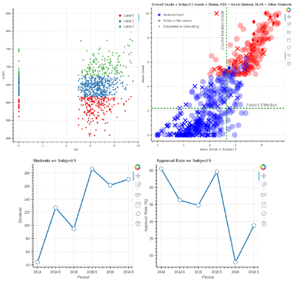

# bti-performance-study

Data set used: grades of BTI students in UFRN from 2014 to 2016 (avaliable in data folder).

First part consist in the analysis of data [AD], using statistics to find problems related with low performance.

Second part consists in a set of analysis starting from three differents hyphotesis:

## [H1] Based on alarming low grades in subject 5, is there a difference between students that are good in this subject and who aren't? Is low performance in subject 5 related to course abandonment? Are these low grades prejudicing the course in any way?
- [Jupyther Notebook](src/notebook-2.ipynb)
- [HTML](result/notebook-2.html)

## [H2] Clustering based on academic indexes looking for relation between MC, percentage of approval and enem grade, also plotting clusterings in maps
- [Jupyter Notebook](src/notebook-3..ipynb)

## [H3] Look for relation between students grades and distance from IMD (where students have classes)

This project uses pandas, bokeh, geocoder and numpy in jupyter notebook.

The notebooks are in src folder: 
- [AD] rai's notebook

## Some of the plots generated:

